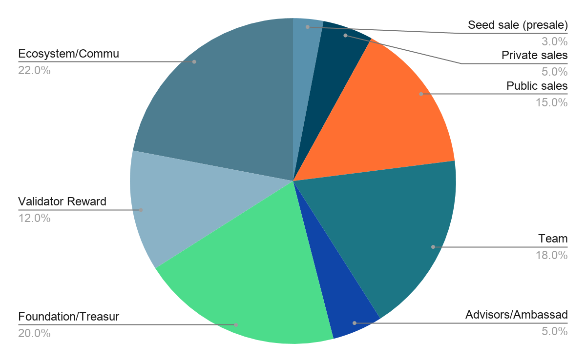

# Abstract

Blockchain is a useful and revolutionary technology which is getting a lot of attention recently. However, despite much anticipation, no significant blockchain adoption has been observed. 

Icetea is a platform designed to enable the first useful and widely-adopted decentralized application (dApp). In the long run, it aims to be a viable decentralized alternative to cloud computing platforms. 
 
The blockchain industry is yearning for the first ’killer app’ to validate this technology. Although plenty of blockchains exist with billions of USD invested, such an application remains elusive. If Icetea can do that, it is a game-changer. 
 
 

# Introduction to Icetea Platform

## What is Icetea?

Icetea is an international-level, made in Vietnam platform, designed to develop decentralized applications using blockchain technology. It’s optimized to tackle various real-world, math-related problems to the highest standard of practice and efficiency demanded from the non-stop technological industry nowadays.

This platform includes blockchain plus many software developer support services, where collecting fees from those services is the main source of revenue along with gathering funds from the issuance of tokens.

## Vision & Mission

Icetea Platform’s sole goal is to enable the first useful and widely-adopted blockchain application - one that can easily be used by many people across various businesses, even those who do not have deep knowledge about computers. Such an application would validate blockchain technology, infuse trust, and open the door to a new era of dApps.

The final, long-term goal is to offer a viable alternative platform comparable to cloud computing application platforms. Developers then could choose either centralized or decentralized technology, or a combination of both, depending solely on the value of application data and trustworthiness of relevant parties instead of the maturity and usability of the underlying technology.

## What does Icetea help?

#### The blockchain landscape and roadblocks:

The blockchain’s chaotic gold rush will be over soon. When the dust settles, only the ones who solve real-world problems and bring value to people will survive and prosper. However, many blockchain applications nowadays still put heavy burdens on users. Indeed, while the benefits they promise are often abstract and ambiguous, the friction they introduce has already been concrete and immediate.

#### Icetea’s distinctive and practical approach:

Icetea brings frictionlessness into the UX to make decentralized applications (dApps) more approachable for end-users, to the point that they will not notice those are ‘blockchain’. At the moment. none of the current blockchains can do that. Our mission is to realize the world’s first killer blockchain app - one that is used by millions.
 
 

# Icetea Features and Services

## UX-enabling features
### Icetea ID

In order to prevent central authorities from abusing, blockchain apps require users to keep long and forgettable private keys or mnemonic phrases. Once lost, they lose access to their accounts completely without any way to recover. “I forgot password” feature is simply non-existed, and calling customer services doesn't make any difference either. In practice, users often save their keys, in plain text, on some note-keeping programs. However, this action significantly increases the risk of their keys being stolen or eavesdropped on. 

Thus, Icetea ID is born to tackle this issue. It encrypts a user’s private key, splits it into parts, and safely stores it on multiple independent and secure key management services. This lifts the burden of keeping keys off users’ shoulder, while still preventing any single central authority from gaining access to the keys. Furthermore, recovery and 2nd factor authentication are possible for Icetea ID; and thus, onboarding and authentication will be much smoother with password-less experience – using either phone number, email, or social accounts to register. 

### Signing Token

Current blockchains require users to use private keys directly to sign every transaction. This repetition task increases the risk of leaking private keys, which, once happens, will lead to catastrophic consequences. As a result, blockchain apps often request their users to perform many inconvenient steps that drastically damage UX. 

Instead, a signing token can be used in place of the private key solely for signing transactions. Each signing token has an expiry time and a limited set of permissions (e.g. can only sign transactions whose values are within predefined limits). Thus, leaking signing tokens yield much less serious consequences compared to that of private keys. By using Signing Token, blockchain apps can later introduce handy features such as "remember me on this device" and even increase session timeout (no need to re-login after a while of inactivity). 

### Account Classification

On current blockchains, all accounts are bank accounts (that is, they store cryptocurrency). Bank accounts require a high level of security. Even if an account is not designed to store cryptocurrency, the same over-strict security policy applies, which is too inconvenient to users.

Icetea distinguishes between bank accounts and regular accounts. Regular accounts cannot receive and store cryptocurrency while bank accounts still function as they have always been. This is a meaningful piece of information for apps to fulfill the trade-off between security and convenience. For example, apps can include a "don't ask again" checkbox to reduce the number of future permissions or password prompts. 

### External Payer

On current blockchains, a user has to stake or pay some amount of cryptocurrency (often called gas or fees) for each transaction he/she makes. Therefore, to try out an application, they will have to go to some unfamiliar and insecure exchanges to buy some cryptocurrency first. This has already made onboarding an unpleasant experience right from the beginning. 

Despite the fact that some apps try to mitigate this by utilizing a central payer, still, doing this ruins the benefit of blockchain. To overcome this hassle, Icetea allows an application to pay transaction fees for its users in a decentralized manner. As a result, Onboarding becomes seamless since apps now can employ much more flexible monetization strategies, such as free, freemium, pay-to-unlock, and in-dapp-purchase models.

## Biz-ready features
### 1-click Token Issuing

Issuing a token is a lengthy and complicated process, especially when it involves customized business rules as well as the current firm’s technology infrastructure. This raises the cost of entry to the point that intimidates most small enterprises.

Icetea has built-in support for common token types and rules, which turns the cumbersome process of token issuing and distribution into a simple task. To issue a token, all users required to do is simply fill out a form, no more complex step, no more legality concern. Plus, a small number of token issuing fees are applied to prevent spamming issues. 

### Reusable Biz Templates

The undeniable truth is, it really does take lots of time and manual efforts to create a biz app on a blockchain. The immediate costs, both tangible and opportunity, combining with the uncertainty of future return significantly hamper the blockchain adoption rate. 

Icetea provides templates and building blocks for common tasks. Developers can get started quickly, and have their PoC up and running in a short time while external contributors and 3rd parties can also publish their shared packages to Icetea’s public package repository.

### Privacy Computation

Transparency is a notable characteristic of blockchain. However, in this practical world, most users want to keep some parts of their data secret. Such secrets cannot be posted to smart contracts, thus limit the number of use cases of blockchain.

Another problem is that blockchain transactions are just pseudonymous. In theory, the transaction sender’s address is merely some random text; however it is totally possible to trace such addresses to real people if they do KYC and their KYC data are abused or leaked. 

Hence, Icetea comes into the play by providing a TEE (Trusted Execution Environment) for applications run on its platform to handle sensitive data without ever exposing anything to the public. These data are encrypted before sending to the blockchain, then the TEE securely performs computation and discards the data right after. For those who want to conceal their transactions, they could transfer their assets to a privacy-focus sidechain first, do all their transactions there, and withdraw their assets back to the main chain.

## Utility features
### Asset Inheritance

If a person suddenly passed away (e.g. in an accident), his/her entire crypto fortune will be locked forever as no one else has the private key to access the account. This is a notable characteristic of using cryptocurrency, however not everyone wants that.

To overcome this drawback, Icetea allows a person to set others as inheritors. When the owner is inactive for a predefined period, one of the inheritors could activate the inheritance workflow to claim his/her inheritance rights, similar to a normal inheritance.
Account Permissions

### Account Permissions

It is a common situation that an account is owned by a group of people and has specific rules of management. On other blockchains, people achieve this by creating custom smart contracts, which is costly error-prone. 

Icetea has a built-in fine-grained permission mechanism that supports each of the common scenarios, be it multiple-signature gathering, 2nd-factor authentication, spending budget, and quota. Account owners can set permissions for others, right from within their wallets.

### Decentralized Chatbot

Smart contracts are valuable tools to deliver promises in a trusted way. However, instead of interacting with them directly. users have to go through some middleware applications which require lots of time and effort to build. Such apps are often ambiguous, hence raising unwanted trust-issues. 

Icetea supports a special type of smart contract, named "decentralized bot". Those bots reside on blockchain and can respond to users' queries. What’s more, bots can be stateful (e.g. they remember the user's previous messages) which can create meaningful conversations. Users can now chat to smart contracts right inside their wallets.

## Professional services
### DocuGuard

Blockchain storage is scarce; hence, it is unaffordable to keep large data and files on-chain.
Instead, they can possibly be stored on a cloud service and link (hash) them back to the blockchain. However, many apps want to avoid that centralized cloud to ensure complete censorship-resistance of their users' files. 

DocuGuard is a professional, reliable, censorship-resistant decentralized storage service built upon the famous IPFS protocol. All applications built on Icetea Platform can now easily integrate with DocuGuard and Developers can conveniently pay for DocuGuard services using well-known Icetea tokens. 

### Decentralized Gate

Almost every non-trivial blockchain app needs to interact with the off-chain world. Yet blockchain, due to its decentralization nature, prohibits such interaction. To overcome this situation, some applications have been using a centralized service (often called Oracle service). Although such a service does work, it decreases users' trust in the system. 

Icetea offers a solution called Decentralized Gate - a network of computers constantly on the alert and competes to serve off-chain data to smart contracts. A reward-based game is designed to ensure fairness and decentralization. It helps applications access the off-chain world in a decentralized manner and at an affordable price.

### Icetea Enterprise Edition

In practice, many enterprises prefer to use a private chain rather than a public one to maintain a certain level of privacy. All data are sensitive and should be available to just a limited number of stakeholders.

To resolve the above concern, Icetea comes with Icetea Enterprise Edition, a private-chain variation of Icetea. It is also possible to sync portions of the private chain’s data to the public chain, which turns the system into a legitimate hybrid chain. 

As a result, enterprises have many options to deploy their apps: either on a private chain, a hybrid chain, a public sidechain, or the Icetea public chain, all depending solely on their business needs.

## Scalability features
Built upon the battle-tested Tendermint engine, Icetea offers powerful solutions that enable apps to scale to millions.

### Powerful Consensus Engine
At its core, Icetea uses Tendermint, the exceptional consensus engine which also powers the world’s top blockchain networks like Cosmos Network and Binance Chain – a super-active decentralized exchange.

### Parallel Transaction Execution
Most blockchains are still in their early stages, and transactions are processed sequentially. Icetea’s capacity of smartly selecting transactions for executing in parallel greatly improves transaction processing throughput.

### Sidechain & Autonomous Area
Highly busy applications can offload workload to sidechains or Autonomous Areas - a special
sidechain whose security and decentralization are taken care of by the mother chain. 

## Developer tools
Developing blockchain apps on Icetea is almost as easy as regular apps: reuse of well-known packages, advanced debugging techniques, and much more ...

### Languages & Tools 
Icetea Studio and other development tools let developers write and test smart contracts easily in either JavaScript or Rust, and integrate seamlessly with existing development workflows.

### Reusing Existing Libraries
No need to reinvent the wheel, developers can reuse existing NodeJS packages, including lodash and @hapi/joi, for their Icetea blockchain apps.

### Enhanced Debugging
Debugging is just a breeze on Icetea which supports advanced debugging techniques like setting breakpoints, stepping, watching variables, and performance profiling.
 
 

# Icetea Architecture

To understand how Icetea Platform resolves those challenges, first, we need to take a look at its system architecture.

Figure 1: Icetea platform architecture

Icetea blockchain is an account-based (as opposed to UTXO) blockchain. Every transaction is a contract call. For example, to issue or transfer an asset, one calls the ‘issue’ or ‘transfer’ function, respectively, of the ‘Assets’ system contract. To deploy a smart contract one calls the ‘deploy’ function of ‘ContractDeployer’ system contract, supplying the contract’s bytes. This way, the blockchain core can handle all transactions the same way, avoiding the maintenance overhead of the approach of using transaction types.

Under the hood, a full node includes the following primary components.

1. <b>Tendermint Core</b>​ for peer-to-peer, consensus, and transaction raw data management. Tendermint also includes an RPC interface for clients to submit transactions and query states.

2. A <b>​Transaction Analyzer</b>​ to analyze transactions, put them into groups, and dispatch them to the Transaction Executor Pool.

3. A ​<b>Transaction Executor</b> Pool​ is a process pool to isolate contract execution environments from the main process for safety reasons. Transactions can run in parallel by different processes if the Transaction Analyzer determines so.

4. A ​<b>Contract Execution</b> Engine​ which executes the smart contract. It is a wrapper around Google V8 Engine, supporting both JavaScript and WebAssembly.

5. A <b>​State Manager</b>​ to manage global state. It persists state to a LevelDB and maintains a state cache similar to Redis. State can be accessed from other processes like ones from the Transansaction Execution Pool.

6. A bunch of <b>​System Contracts</b>​ to enable Icetea Blockchain features like Asset Management, Alias (Naming) Management, Digital Identity, Permissions, Decentralized Gate, etc. Decentralized Gate is where a contract can communicate with the external, off-mainchain world.

The Icetea Platform specifies how the blockchain shall communicate with off-chain data sources, trusted execution environments, and other blockchains. It also defines a protocol for working with a type of integrated sidechain called ‘autonomous area’. 
 
 

# Token Economics

## Sale

<b>Max Supply:</b>  200,000,000 TEA 

| Sale Type | Dedicated Token | Price | Collecting | Release Date | Duration |
|-----------|-----------------|-------|------------|--------------|----------|
| Seed Sale | 6M TEA | US$0.03 | US$180,000 | Dec 19th | 30 days |
| Private Sale | 10M TEA | US$0.04(~) | US$400,000 | Jan 18th | 30 days |
| Public Sale | 30M TEA | US$0.06 | US$1.5M | Feb or Mar | 30 days |

<i>Note:</i> For Private Sale,  the price depends on strategic partners, negotiable but can’t be less than US$0.04/token. Colection is US$400,000 estimately.

### Total Tokens Sale
 46,000,000 TEA 

### Total Fund Raise
 US$2,080,000 

 

Figure 2: Icetea token distrubution

 
 

Figure 3: Icetea fund allocation

 
 

# Roadmap

### 12/2021
- Launch closed network
- Launch FitGO
- Launch inRECT
### 4/2022
- Launch iTEE
- Launch LoveLock
### 2nd half of 2022
- Launch open network
- Launch Logistics app
 
 

# Instruction for Developers

To start working with Icetea blockchain programming, please review the [complete guide on Icetea Document](https://docs.icetea.io/guide/).
 
 

# Instruction for Validators
Will be added later

 
 

# Conclusion
Will be added later

 
 

# Frequent Asked Questions
Will be added later

 
 

# References
Will be added later

 
 

