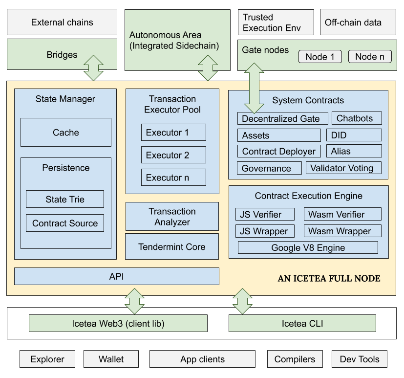

# Icetea Architecture

To understand how Icetea Platform resolves those challenges, first, we need to take a look at its system architecture.

Figure 1: Icetea platform architecture

Icetea blockchain is an account-based (as opposed to UTXO) blockchain. Every transaction is a contract call. For example, to issue or transfer an asset, one calls the "issue' or "transfer' function, respectively, of the "Assets" system contract. To deploy a smart contract one calls the "deploy" function of "ContractDeployer" system contract, supplying the contract’s bytes. This way, the blockchain core can handle all transactions the same way, avoiding the maintenance overhead of the approach of using transaction types.

Under the hood, a full node includes the following primary components.

1. <b>Tendermint Core</b>​ for peer-to-peer, consensus, and transaction raw data management. Tendermint also includes an RPC interface for clients to submit transactions and query states.

2. A <b>​Transaction Analyzer</b>​ to analyze transactions, put them into groups, and dispatch them to the Transaction Executor Pool.

3. A ​<b>Transaction Executor</b> Pool​ is a process pool to isolate contract execution environments from the main process for safety reasons. Transactions can run in parallel by different processes if the Transaction Analyzer determines so.

4. A ​<b>Contract Execution</b> Engine​ that executes the smart contract. It is a wrapper around Google V8 Engine, supporting both JavaScript and WebAssembly.

5. A <b>​State Manager</b>​ to manage global state. It persists state to a LevelDB and maintains a state cache similar to Redis. The state can be accessed from other processes like ones from the Transansaction Execution Pool.

6. A bunch of <b>​System Contracts</b>​ to enable Icetea Blockchain features like Asset Management, Alias (Naming) Management, Digital Identity, Permissions, Decentralized Gate, etc. A Decentralized Gate is where a contract can communicate with the external, off-mainchain world.

The Icetea Platform specifies how the blockchain shall communicate with off-chain data sources, trusted execution environments, and other blockchains. It also defines a protocol for working with a type of integrated sidechain called "Autonomous Area".
