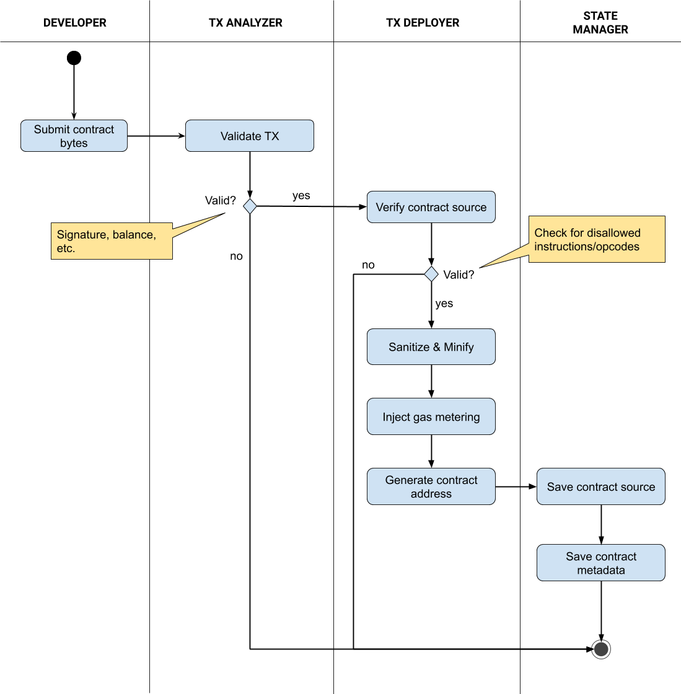
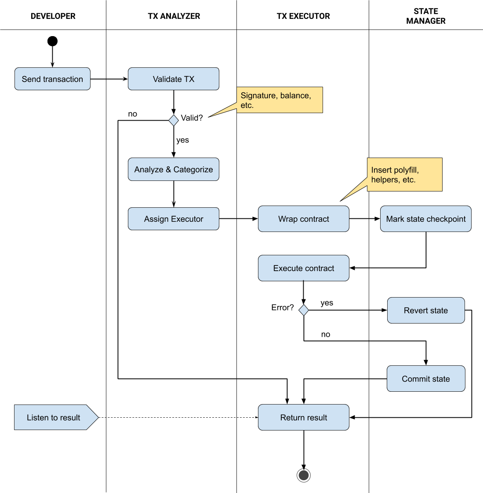

# Key Concepts

## Asset System
Unlike Ethereum where each token has its own contract, Icetea Platform manages all assets via the Assets system contract. Think of it as a registry of all assets. It supports well-known asset types like fungible (similar to Ethereum’s ERC-20) and non-fungible ones (similar to Ethereum’s ERC-712) out of the box. Users can easily issue one by calling a function on the Assets contract, supplying asset parameters and sufficient issuance fees. No source code is needed.

In rare cases when you want to create a custom asset, you can deploy a smart contract extending the builtin asset with custom behaviors, or create a completely new type of asset.

There is no distinction between a ​coin​ and a ​token​. All are assets and Icetea Platform treat them the same. At the time of mainnet launch, Icetea blockchain comes with a pre-issued asset named TEA. This asset is used for gas cost and fees. Future assets can also be used for gas cost and fees, by converting to TEA via the Exchanges system contract.

Compare to Ethereum token system, this asset system has some advantages.
- It allows the system to implement ‘regular account’ feature
- It allows the system to apply permissions to any assets’ transfers
- Without the distinction between coins and tokens, apps can handle assets consistently and no need to create a wrapped token for native coin
- Contracts which do not expect to receive assets can explicitly refuse them. This prevents the problem of tokens get stuck in contracts as happened in Ethereum.
- Apps and Wallets can easily list all assets owned by a specific account. This helps users manage all of their assets conveniently
- Reduce the effort to code, audit, deploy hundreds to thousands of token contract similar to each other

Although it is possible for developers to create a token using a contract similar to that of Ethereum, doing so will exclude the token from built-in support for permission management, exchange, moving assets to sidechains, etc. Therefore, we strongly recommend using asset system to issue and manage assets.

## Smart Contracts 
### FORMAT AND EXECUTION ENGINE

Smart contracts, or contracts for short, are at the heart of Icetea blockchain. Every transaction is a contract call.

Icetea blockchain supports 2 contract format: JavaScript and WebAssembly. Other languages can be compiled into either JavaScript or WebAssembly before deploying to
the blockchain.

Under the hood, Icetea blockchain uses Google's V8 engine to execute contracts. V8 is currently the most powerful, advanced, and mature engine for both JavaScript and WebAssembly.

### CONTRACT TYPES
There are 2 types of contracts.

<b>SYSTEM CONTRACTS</b>​ are contracts built into the blockchain. They handle system tasks like asset issuance and transfer, permission management, user-uploaded contract verification and deployment, etc.

Because system contracts are part of the system, they run in-process and in the same context with the system.

<b>USER CONTRACTS</b>​ are contracts that developers upload to the blockchain. Transactional calls to these contracts need to be verified and wrapped, grouped for
possible parallel execution before dispatching to a process pool for execution.

Besides contracts, one can also deploy libraries, which can be called from other libraries or contracts but cannot be called directly from clients. 

### DEPLOYMENT
The following diagram denotes what happens when you deploy a smart contract.

 
 

Figure 2: Smart contract deployment

### EXECUTION
After deployment, you can send messages to the smart contract (that is, call the contract’s functions). There are basically 2 types of contract functions: ones that do not change state and ones that does. Calls that change state must be sent as transactions which require consensus on the network and thus cost some gas Calls that does not change state is gas-free and can return instantly.

The following diagram shows the flow of a contract call that changes state.

 
 

Figure 3: Smart contract execution

### CONTRACT SAFETY
Contracts submitted by users can contain dangerous code, either unintentionally (bugs) or on purpose (exploits, hacks, vandalizing, etc.). Icetea blockchain performs the following measures.
- Gas-based strategy to limit the amount of resources a contract call can use. For more details about gas calculation, please refer to Transaction Fees section
- Scan for unsafe code: at deployment, the contract is scanned for unsafe code. This includes code that attempts to escape the execution sandbox and code that
is deemed un-polyfillably indeterministic
- Wrap in sandbox: the contract is wrapped in an execution sandbox guarded against unsafe behaviors
- Running out-of process: the contract runs in a different process. If it crashes or leaks memory, the main process and other concurrently running contracts are not affected
- Validators can vote on malicious contracts to increase gas prices or ban them completely
- Dangerous patterns could be discovered over time and voted into unsafe code so that the unsafe code scanner (linter) can stop them in the future

It should be noted that the blockchain cannot detect contracts which attempt to scam users. Users should interact with verified and audited dApps only.

### VERSIONING
Icetea blockchain supports versioning for both contracts and libraries. Version is an integer number, starting from zero. One can deploy an update contract or library to the same address. This will increase the version by one.

To avoid breaking changes, client can specify which version of the contract it wants to communicate with (default is latest version). A contract can also specify which version of the library it want to load.

## Light Clients
Light client support is part of the Tendermint consensus and it works seamlessly with Icetea blockchain. The strong point of Tendermint light clients are that their proofs are very succinct​. ​While a Bitcoin light client must sync chains of block headers and find the one with the most proof of work, a Tendermint light client just need to keep up with changes to the validator set. This makes it an ideal candidate for mobile and internet-of-things use cases.

## Cross-chain Communication
Because Icetea blockchain uses Tendermint Core under the hood, it is trivial to connect Icetea to ​Cosmos Hub​. We would decide how and when to connect to it later.

Besides Cosmos, for direct cross-communication with other chains like Ethereum, EOS, Tronx, etc., corresponding 2-way bridges must be built. Icetea Blockchain’s smart contract system is capable of building this kind of bridges. Because this is not specific to Icetea blockchain, this paper will not discuss in detail. Ones who are interested may refer to Kyber Network’s ​Waterloo Bridge​ and other similar solutions for reference and inspiration. The advantage is that, due to the compactness of Tendermint light client proofs, you do not need to sync Icetea block headers to the other chain, just keep track of the changes of its validator set. This makes a 2-way bridge between Icetea and chains like EOS very cost effective.

One addition is that it is possible to utilize the Icetea's node gate network to relay information from one chain to others.

## Governance
After releasing to mainnet and running stably, the governance of Icetea blockchain will be transferred to Icetea Foundation, a non-profit organization.
The governance rules of Icetea are designed with the following goals in mind:
1. Can handle emergency situations
2. Done on-chain and every stakeholder can vote

During childhood period (first 12 months from mainnet release), everyone can propose but only validators vote. Voting power of a validator is the sum of its own stake and the combined stake others delegate to it. Voting period is short. Part of the validator's deposit is slashed if it does not vote in time.

After childhood, the blockchain enters mature period. Voting period takes longer. Everyone can explicitly vote or delegate its stake to a validator. Changes to the blockchain are requested in the form of proposals. People must deposit sufficient amount to back the proposal before it becomes eligible for voting.

There are 3 types of proposals:
1. Blockchain Parameter Changes​. This includes blocksize, blocktime, number of validator, ratios of transaction fees awarded to validator, whitelisted libraries, etc. Some parameters requires only validators to vote (e.g. blacklist a smart contract) while others open to all stakeholders (e.g. change compensation ratio). These parameters can be changed automatically after the proposal passes (i.e. this type of proposal does not require a software update)
2. Emergency State Declaration​: put blockchain back to childhood state for a specified period of time. This is a special type of Blockchain Parameter Changes.
The blockchain also supports a mechanism so that it can enter Emergency State automatically without the need of passing a proposal when certain vital indicators enter dangerous zone. However, the list of indicators are not yet determined at phase 1.
3. Advanced Changes​: this includes both software update and update to the governance model itself. This type of proposal cannot be automated and must be presented in the form of an improvement proposal paper. People can get their proposal-backing deposit back after the proposal passes, or it does not enter voting period.

## Migration from Ethereum 
### ASSET MIGRATION
ETH or tokens on Ethereum could be moved to Icetea blockchain using a bridge as described in ​Cross-chain Communication​ section. The bridge could be 1-way (Ethereum to Icetea only) or 2 ways, depending on your specific use case.

### CONTRACT MIGRATION
Because there are Abstract Syntax Tree (AST) parsers for both Solidity and JavaScript, it is possible to write a Solidity to Javascript transpiler. The ​Sunseed​ tool supports Decorated JS​, a JavaScript class structure similar to Solidity contract, so it is easier to transpile Solidity to it. A sample tool for this could be found at https://github.com/TradaTech/solidity2js​