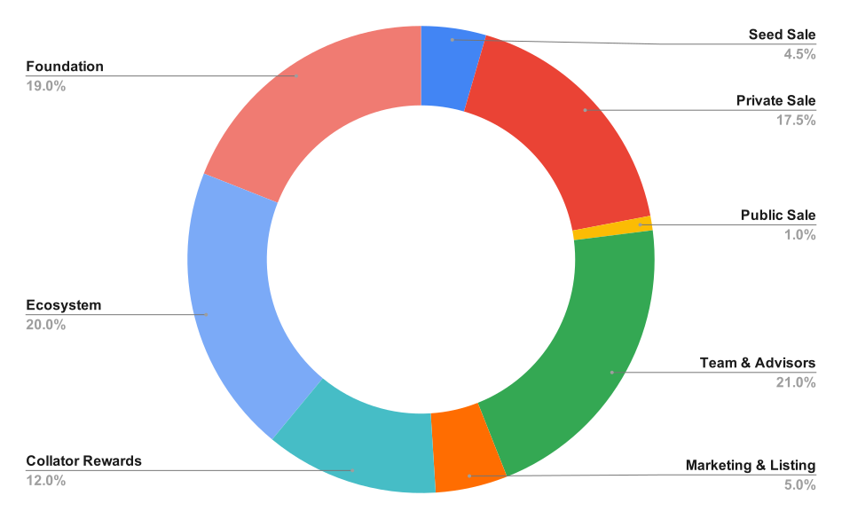
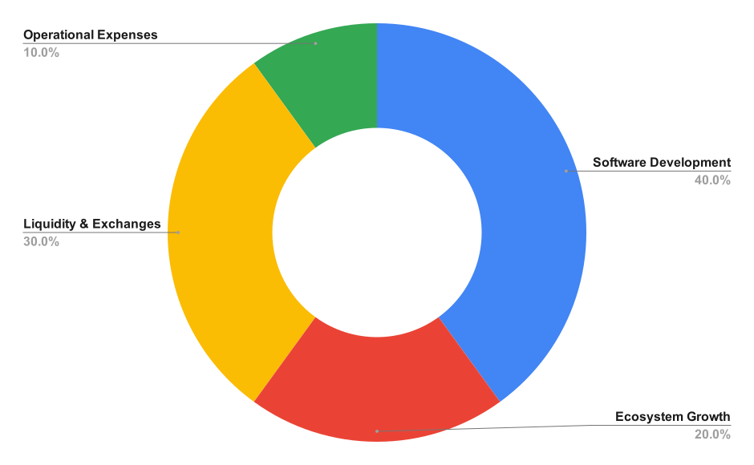
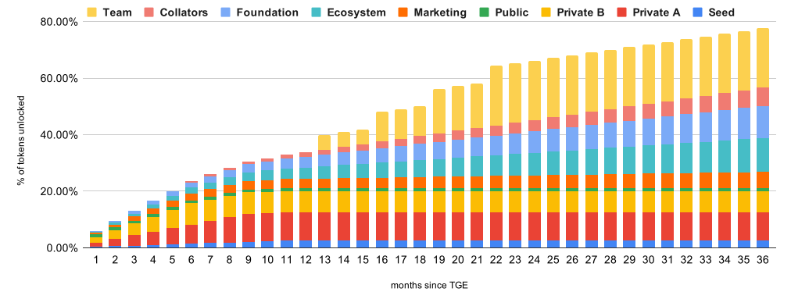

# Token Economics

## Token Information

- Token Name: __TEA token__
- Token Symbol: __TEA__
- Total Supply: __200,000,000__

_TEA token_ is an Ethereum's __ERC-20__ token. In the future, when Icetea blockchain launches the mainnet, TEA token holders can swap ERC-20 TEA token for _native_ TEA coin at the rate of 1 for 1.

## Token Utility

- Payment for transaction fees (computation & storage)
- Staking for validators to earn share of block rewards
- Staking to participate in the chain's governance process and earn rewards for voting on proposals
- Payment for Icetea Platform & partners' services (Icetea ID, DocuGuard, etc.)

## Token Allocation

## Token Sales
### Sale Rounds
__Total Supply:__ 200,000,000 TEA

| Round | Amount (TEA) | Rate (USDT) | Raise (USDT) | Start (2021) | End (2021) | Diluted MCap  |
|-------|--------|------|-------|-------|-----|----|
| Seed | 8M (4%) | 0.03 | 240K | Jan 1 | Jan 11 | 6M USDT |
| Private | 28M (14%) | 0.06 | 1.68M | Jan 15 | - | 12M USDT |
| Public | 10M (5%) | 0.12 | 1.2M | Feb or Mar | - | 24M USDT |

- __Total Token For Sales__: 46,000,000 TEA (23% of Total Supply)
- __Total Fund Raised:__ 3,120,000 USDT (estimated)

#### Note:
- The rate of Seed round is set to be 1 ETH for 20,000 TEA. The rate in USDT is approximate.
- The numbers for Private Sale and Public Sales are planned numbers and might change slightly depending on market and business conditions. However, the total number of token for swap for these 2 rounds are determined 19% of total supply

### Usage of Fund Raised

## Token Release Schedule

### Release Summary
- Seed & Private: 40% at 90 days after swap day, then 20% after each 90-day period
- Public: Release all at listing event
- Team & Advisors: 25% each 6-month period
- Validators: 2% each month since mainnet launches. Refer to [Validator Tokenomics](#validator-tokenomics) section for more details.
- Ecosystem: 2.5% each month

### Circulating Supply by Month

**Note** _Team_ in the charts includes Team & Advisors.

## Validator Economics

To attract dapp developers and users, Icetea's transaction fees are cheap, just enough to prevent spamming. Therefore, to ensure validators profitable, most of validators' rewards should come from other sources.

Icetea blockchain reserves 12% of total supply for Validator Reward Fund (VR Fund). That is 24M TEA.

The initial VR Fund will be used up after 5 years. In the first 3 years, the entire validator rewards come from this fund. From year 4 onward, Icetea platform starts to mint TEA gradually to compensate the validators.

| Year | No of Validators | Monthly VR Fund | Monthly Mint | Monthly Reward/Validator |
|------|------------|-----|------|-------|
| 1 ~ 3| 30 | 480,000 | 0 | 16,000 TEA |
| 4 ~ 5| 50 |  280,000 | 520,000 | 16,000 TEA |
| 6 onward | 100 | 0 | 1,600,000 | 16,000 TEA |

At the token price of Public Sale, each validator earns 1920 USDT monthly. If the TEA price increases, validator rewards will be more attractive and more people will nominate to be validator candidates, thus make the system more secure.

All of the validator economics parameters (including the number of validators) are subject to Icetea blockchain governance process. As a result, Icetea blockchain can alter itself to adapt to the changing economic environment.