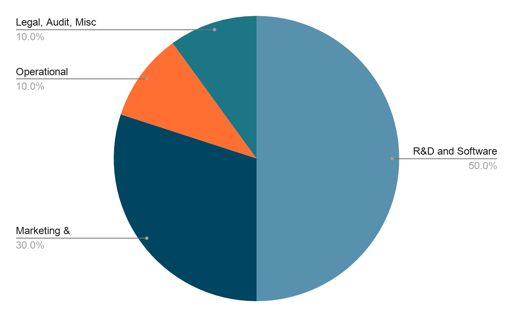

# Token Economics

## Sale

<b>Max Supply:</b>  200,000,000 TEA 

| Sale Type | Dedicated Token | Price | Collecting | Release Date | Duration |
|-----------|-----------------|-------|------------|--------------|----------|
| Seed Sale | 6M TEA | US$0.03 | US$180,000 | Dec 19th | 30 days |
| Private Sale | 10M TEA | US$0.04(~) | US$400,000 | Jan 18th | 30 days |
| Public Sale | 30M TEA | US$0.06 | US$1.5M | Feb or Mar | 30 days |

<i>Note:</i> For Private Sale,  the price depends on strategic partners, negotiable but can’t be less than US$0.04/token. Colection is US$400,000 estimately.

### Total Tokens Sale
 46,000,000 TEA 

### Total Fund Raise
 US$2,080,000 

 

Figure 2: Icetea token distrubution

 
 

Figure 3: Icetea fund allocation
