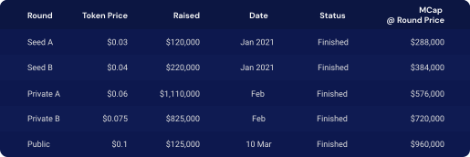

# Token Economics

## Token Information

- Token Name: __PKF token__
- Token Symbol: __PKF__
- Total Supply: __200,000,000__

_PKF token_ is an Ethereum's __ERC-20__ token. In the future, when PolkaFoundry blockchain launches the mainnet, PKF token holders can swap ERC-20 PKF token for _native_ PKF coin at the rate of 1 for 1.

## Token Utility

- Payment for transaction fees (computation & storage)
- Staking for collators to earn share of block rewards
- Staking to participate in the on-chain governance process and earn rewards for voting on proposals
- Payment for PolkaFoundry & partners' services (PolkaID, DocuGuard, etc.)

## Token Allocation
<!--  -->

## Token Sales
### Sale Rounds

<!--  -->

### Usage of Fund Raised
<!--  -->

## Token Release Schedule

<!--  -->

## Collator Economics

To attract dapp developers and users, PolkaFoundry's transaction fees are cheap, just enough to prevent spamming. Therefore, to ensure collators profitable, most of collators' rewards should come from other sources.

PolkaFoundry blockchain reserves 12% of total supply for Collator Reward Fund (VR Fund). That is 24M PKF.

The VR Fund will be used up after 5 years. In the first 3 years, the entire collator rewards come from this fund. From year 4 onward, PolkaFoundry starts to mint PKF gradually to compensate the collators.

| Year | No. of Collators | Monthly VR Fund | Monthly Mint | Monthly Reward/Collator |
|------|------------|-----|------|-------|
| 1 ~ 3| 30 | 480,000 | 0 | 16,000 PKF |
| 4 ~ 5| 50 |  280,000 | 370,000 | 13,000 PKF |
| 6 onward | 100 | 0 | 1,000,000 | 10,000 PKF |

In the first 3 years, each collator earns 16,000 PKF as _monthly_ reward. At the PKF price of Public Sale, that is worth 1760 USDT. Monthly collator reward in PKF decreases in later periods. However, as we expect PKF price to increase in the long run, the monthly collator revenue converted to USDT should improve.

All of the collator economics parameters (including the number of collators) are subject to PolkaFoundry on-chain governance process. As a result, PolkaFoundry blockchain can alter itself to adapt to the changing economic environment.
